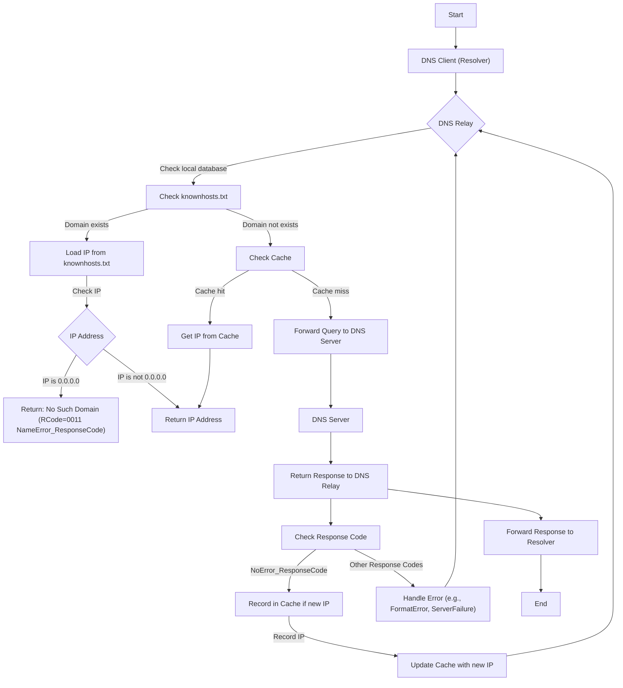

# MyRelay

A simple DNS relay server implemented in C using UDP sockets, deployable on **Unix or Unix-like** machines.


#### How to start

##### Compiling

```shell
cd src && make
```

##### Running

```shell
cd ../bin
```

```shell
./myrelay # or ./myrelay <dns-ip-addr>, google DNS(8.8.8.8) is default
```


#### Functionality

- [x] **Fast Caching Mechanism**: The DNS relay offers a rapid caching system to efficiently handle DNS requests, ensuring quick responses.
- [x] **Customizable Responses**: By modifying the `knownhosts.txt` file, users can control DNS responses, including assigning `0.0.0.0` to domains on a blacklist.
- [x] **Clear Logging**: The DNS relay provides detailed and clear logs for monitoring and troubleshooting.
- [x] **Low Resource Consumption**: The system is designed to have low CPU and memory usage, ensuring minimal impact on system performance.
- [ ] **Concurrency Support**: The DNS relay is built to support concurrent processing, allowing it to handle multiple DNS requests simultaneously.



